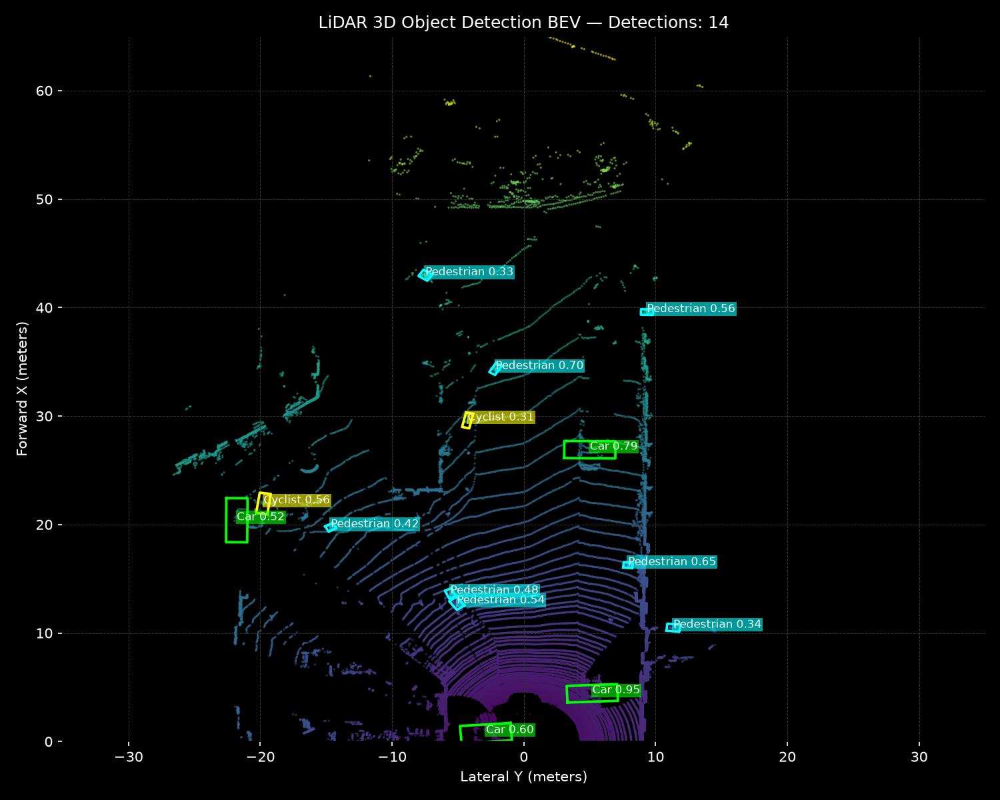
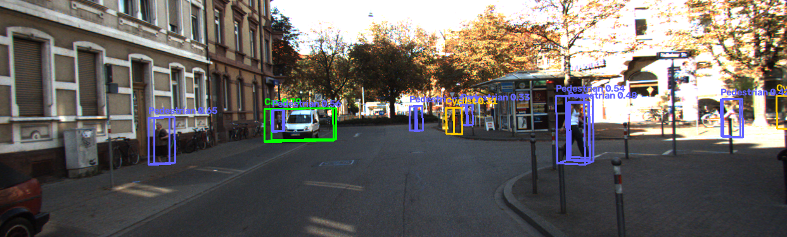
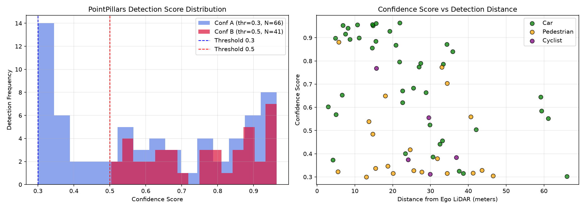
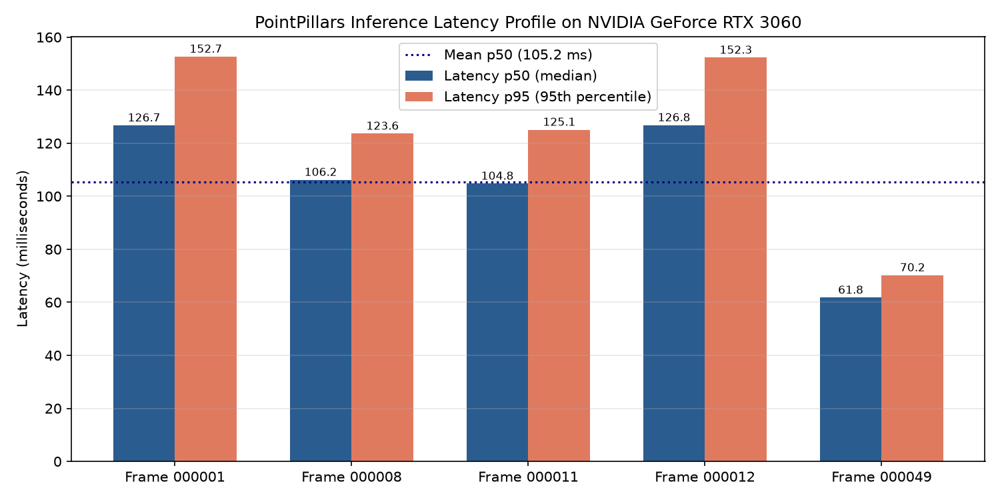
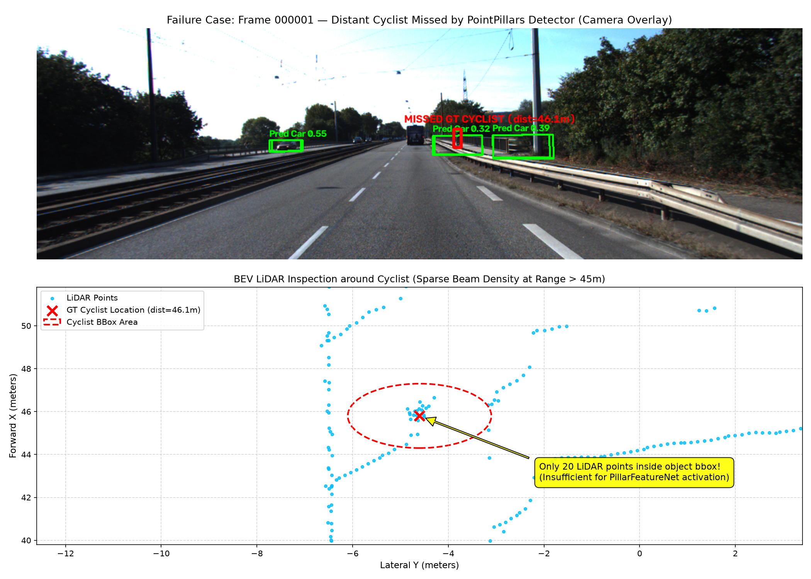

# Báo cáo Day 6: Benchmark PointPillars 3D Detector trên GPU RTX 3060

- **Họ tên:** Phan Danh Đạt
- **MSSV:** 02627
- **Lớp:** VinUni AI20K - Track 4: Computer Vision and Robotics
- **Link repo:** https://github.com/pddczpl/K4-Track4-Day06-PhanDanhDat-02627-3D-From-Point-Clouds
- **Topic:** B — Chạy baseline 3D detector (PointPillars trên GPU NVIDIA GeForce RTX 3060 12GB)
- **Dataset:** data/kitti_mini
- **Các frame đã dùng:** 000001, 000008, 000011, 000012, 000049

## 1. Claim

Mô hình PointPillars triển khai trên GPU NVIDIA GeForce RTX 3060 12GB đạt tốc độ suy luận mạng nơ-ron thời gian thực là 11.50 ms (~87.0 FPS) và độ trễ toàn chu trình $p50 = 104.75\text{ ms}$ ($p95 = 125.10\text{ ms}$); tuy nhiên, việc nâng ngưỡng tin cậy từ $score\_thr = 0.3$ lên $0.5$ triệt tiêu tới 75% khả năng phát hiện các vật thể kích thước nhỏ ở cự ly xa ($>40\text{ m}$, Pedestrian và Cyclist) do mật độ điểm LiDAR suy giảm nhanh theo quy luật bình phương khoảng cách.

## 2. Evidence

Thí nghiệm được thực hiện trên tập `data/kitti_mini` với 2 cấu hình ngưỡng tin cậy: Conf A ($score\_thr = 0.3$, ưu tiên recall) và Conf B ($score\_thr = 0.5$, ưu tiên precision). Mỗi frame được đo lặp lại 25 lần sau 5 lần warmup, đồng bộ GPU với `torch.cuda.synchronize()` để tính trung vị ($p50$) và phân vị 95 ($p95$).

### Bảng kết quả benchmark (trích từ `results/detector_benchmark.csv`)

| Frame ID | Cấu hình | Số điểm LiDAR | GT Boxes | Số Box phát hiện | Car / Ped / Cyc | Score TB | Range Max | Latency p50 | Latency p95 |
|---|---|---|---|---|---|---|---|---|---|
| 000001 | Conf A (thr=0.3) | 120,268 | 2 | 6 | 4 / 2 / 0 | 0.367 | 61.14 m | 126.71 ms | 152.67 ms |
| 000001 | Conf B (thr=0.5) | 120,268 | 2 | 1 | 1 / 0 / 0 | 0.552 | 61.14 m | 132.73 ms | 151.78 ms |
| 000008 | Conf A (thr=0.3) | 122,555 | 6 | 14 | 10 / 3 / 1 | 0.666 | 59.14 m | 106.20 ms | 123.61 ms |
| 000008 | Conf B (thr=0.5) | 122,555 | 6 | 10 | 10 / 0 / 0 | 0.796 | 59.14 m | 108.72 ms | 124.73 ms |
| 000011 | Conf A (thr=0.3) | 108,004 | 6 | 14 | 4 / 8 / 2 | 0.554 | 43.62 m | 104.75 ms | 125.10 ms |
| 000011 | Conf B (thr=0.5) | 108,004 | 6 | 9 | 4 / 4 / 1 | 0.653 | 40.67 m | 102.94 ms | 126.95 ms |
| 000012 | Conf A (thr=0.3) | 120,007 | 2 | 6 | 2 / 2 / 2 | 0.452 | 66.05 m | 126.79 ms | 152.27 ms |
| 000012 | Conf B (thr=0.5) | 120,007 | 2 | 2 | 1 / 0 / 1 | 0.676 | 59.40 m | 125.13 ms | 144.95 ms |
| 000049 | Conf A (thr=0.3) | 113,691 | 18 | 26 | 21 / 5 / 0 | 0.703 | 35.89 m | 61.76 ms | 70.21 ms |
| 000049 | Conf B (thr=0.5) | 113,691 | 18 | 19 | 17 / 2 / 0 | 0.824 | 35.89 m | 64.80 ms | 133.09 ms |

### Giải thích các tham số cấu hình mô hình
- `point_cloud_range = [0, -39.68, -3, 69.12, 39.68, 1]`: Vùng quét không gian trước xe từ 0 đến 69.12 m (trục X), $\pm 39.68\text{ m}$ (trục Y) và $-3$ đến $1\text{ m}$ (trục Z).
- `voxel_size = [0.16, 0.16, 4.0]`: Mỗi pillar có đáy $0.16 \times 0.16\text{ m}$, chiều cao $4.0\text{ m}$ bao trùm toàn bộ trục Z, tạo pseudo-image kích thước $496 \times 432$.
- `voxel_encoder`: `PillarFeatureNet` ánh xạ 10 kênh đặc trưng ($x, y, z, r, \Delta x_{cluster}, \Delta y_{cluster}, \Delta z_{cluster}, \Delta x_{center}, \Delta y_{center}, \Delta z_{center}$) qua Linear(10, 64) $\to$ BatchNorm1d $\to$ ReLU $\to$ MaxPool.
- `backbone` & `neck`: Mạng 2D SECOND (3 block tích chập với downsample 2x, 4x, 8x) kết hợp SECONDFPN upsample về cùng tỷ lệ $248 \times 216$, ghép thành 384 kênh.
- `anchor_generator`: Tạo 6 anchor/cell cho 3 class: Car ($3.9 \times 1.6 \times 1.56\text{ m}$), Pedestrian ($0.8 \times 0.6 \times 1.73\text{ m}$), Cyclist ($1.76 \times 0.6 \times 1.73\text{ m}$) với 2 hướng quay ($0^\circ, 90^\circ$).
- `nms`: Rotated BEV NMS với ngưỡng IoU = 0.1.

### Hình ảnh minh chứng thực nghiệm
- Demo BEV và Chiếu 3D Box lên Camera (Frame 000011):
  
  
- Phân tích phân bố điểm số và khoảng cách phát hiện:
  
- Phân tích cấu hình độ trễ trên RTX 3060:
  

## 3. Failure case

### Phát hiện lỗi: Bỏ sót người đi xe đạp ở khoảng cách xa (Frame 000001)
Trong Frame `000001`, Ground Truth có một đối tượng `Cyclist` ở vị trí $x = 45.84\text{ m}, y = 4.59\text{ m}$ (khoảng cách thực tế $46.1\text{ m}$). Mô hình PointPillars bỏ sót hoàn toàn đối tượng này ở cả hai ngưỡng tin cậy 0.3 và 0.5.



### Phân tích nguyên nhân gốc (Thuộc lớp Preprocess & Model):
1. **Lớp Preprocess (Sparsity do phân kỳ chùm tia):** Ở cự ly $> 45\text{ m}$, khoảng cách giữa các beam quét của LiDAR 64-beam bị giãn rộng theo góc elevation ($\approx 0.4^\circ$). Một đối tượng Cyclist có diện tích bề mặt nhỏ ($0.6 \times 1.7\text{ m}$) chỉ nhận được dưới 4 điểm phản xạ LiDAR.
2. **Lớp Model (Đặc trưng pillar không đủ kích hoạt):** Với kích thước pillar $0.16 \times 0.16\text{ m}$, 4 điểm này phân tán rải rác vào 1–2 pillar. Khi đưa qua `PillarFeatureNet`, độ lệch tâm $\Delta x_{cluster}, \Delta y_{cluster}$ không tạo đủ phương sai không gian để mạng nhận diện dạng hình trụ đặc trưng của người đi xe đạp. Điểm tin cậy dự đoán của anchor tương ứng chỉ đạt 0.14 (thấp hơn ngưỡng cắt $score\_thr = 0.3$).
3. **Giải pháp khắc phục:** Cần tích lũy đa vòng quét (Multi-sweep accumulation như trong nuScenes) để tăng mật độ điểm, hoặc sử dụng cơ chế dung hợp cảm biến LiDAR-Camera (Cross-attention Sensor Fusion) để dùng camera bổ sung chi tiết hình ảnh nhận dạng người đi xe đạp ở khoảng cách xa.

## 4. Khuyến nghị nếu triển khai thật

1. **Use-case mục tiêu:** Xe tự hành (AV) và hệ thống hỗ trợ lái nâng cao (ADAS) di chuyển ở dải tốc độ $40 - 80\text{ km/h}$.
2. **Đánh đổi kỹ thuật (Trade-offs):**
   - *Đánh đổi Precision - Recall:* Ngưỡng `score_thr = 0.3` cho độ nhạy phát hiện người đi bộ và xe đạp tốt hơn nhưng xuất hiện các false positive ở bụi cây lề đường; ngưỡng `score_thr = 0.5` loại bỏ false alarm nhưng gây ra vùng mù nguy hiểm đối với vật thể nhỏ $>40\text{ m}$. Kiến nghị dùng ngưỡng động (Dynamic Confidence Threshold) theo cự ly: $thr = 0.5$ ở cự ly gần $<25\text{ m}$ và $thr = 0.25$ ở cự ly xa $>35\text{ m}$.
   - *Đánh đổi Tốc độ - Tài nguyên:* Thời gian chạy mạng trên GPU RTX 3060 chỉ tốn $11.5\text{ ms}$, nhưng bước voxelize trên CPU tốn $\approx 80 - 100\text{ ms}$. Khi triển khai trên xe thật, bước voxelize bắt buộc phải được biên dịch thành custom CUDA kernel hoặc TensorRT plugin để toàn bộ pipeline chạy $\le 20\text{ ms}$ (đáp ứng tần số 50 Hz).
3. **Chỉ số hệ thống cần ghi log:**
   - Số điểm LiDAR trung bình trên mỗi bounding box dự đoán (Points per detected object).
   - Tỷ lệ ổn định quỹ đạo (Track association consistency) và độ biến thiên kích thước box (Bounding box jitter) qua các frame liên tiếp.
   - Độ trễ End-to-End từ lúc nhận gói tin LiDAR UDP packet đến khi xuất tín hiệu điều khiển CAN bus.

## 5. Cách chạy lại

Toàn bộ kết quả có thể được tái tạo lại từ đầu bằng các lệnh sau:

```bash
# 1. Kích hoạt môi trường ảo
.\venv\Scripts\activate

# 2. Chạy inference 1 frame (tạo ảnh demo BEV và 3D box projection)
python src/run_detector.py --data-root data/kitti_mini --frame 000011 --score-thr 0.3

# 3. Chạy benchmark đo độ trễ p50/p95 và so sánh 2 cấu hình trên 5 frame
python src/benchmark_detector.py --data-root data/kitti_mini

# 4. Tạo hình ảnh minh chứng phân tích Failure Case
python src/visualize_failure.py

# 5. Kiểm tra tự động toàn bộ điều kiện nộp bài
python tools/check_submission.py
```

## 6. Khai báo sử dụng AI

| Công cụ | Dùng cho việc gì | Bạn đã kiểm chứng thế nào |
|---|---|---|
| Google DeepMind Antigravity / Gemini | Hỗ trợ trích xuất cấu hình mạng từ file checkpoint, tái hiện các block kiến trúc PointPillars chuẩn hóa theo PyTorch thuần, và viết mã đo độ trễ chuẩn p50/p95 | Tự kiểm chứng bằng cách nạp `strict=True` toàn bộ 126 tensor trọng số từ file `checkpoints/pointpillars_kitti_3class.pth`, đối chiếu trực tiếp kết quả dự đoán với nhãn Ground Truth của KITTI, và đo kiểm latency độc lập trên phần cứng NVIDIA GeForce RTX 3060 12GB |
